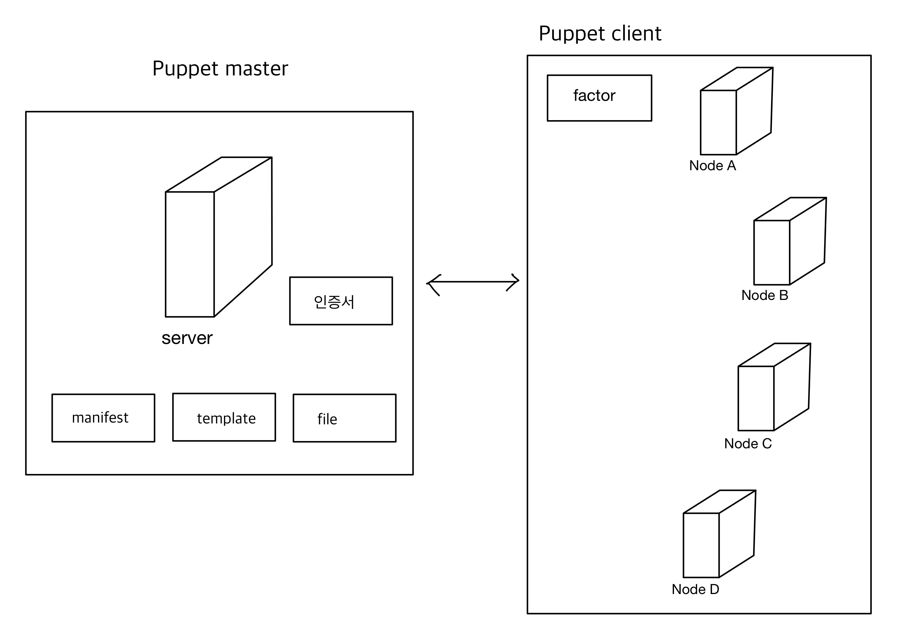
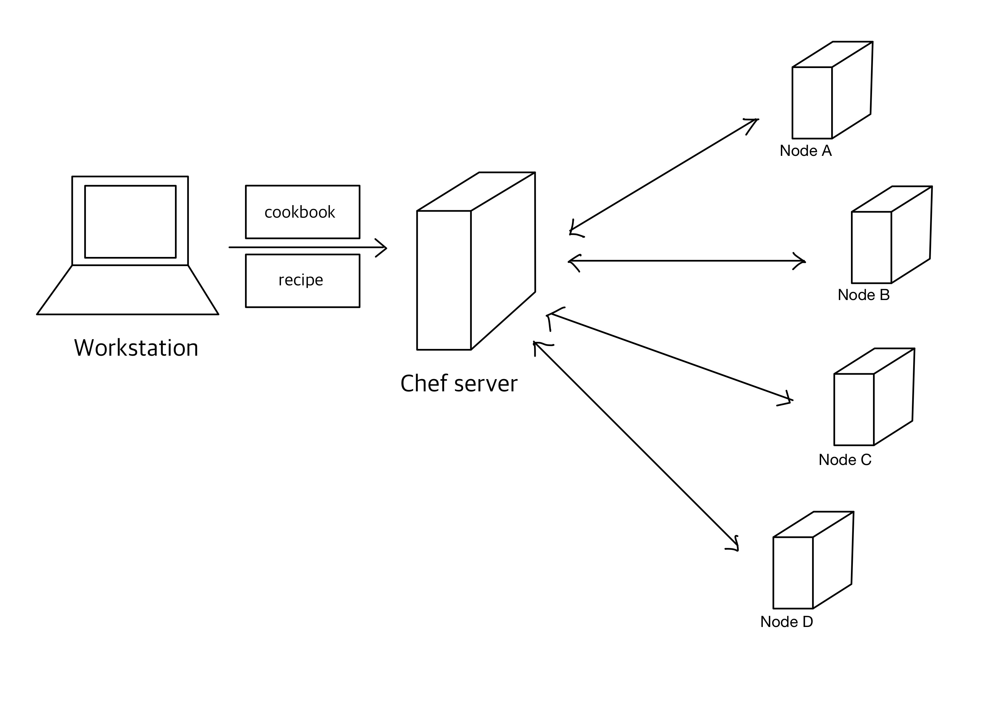
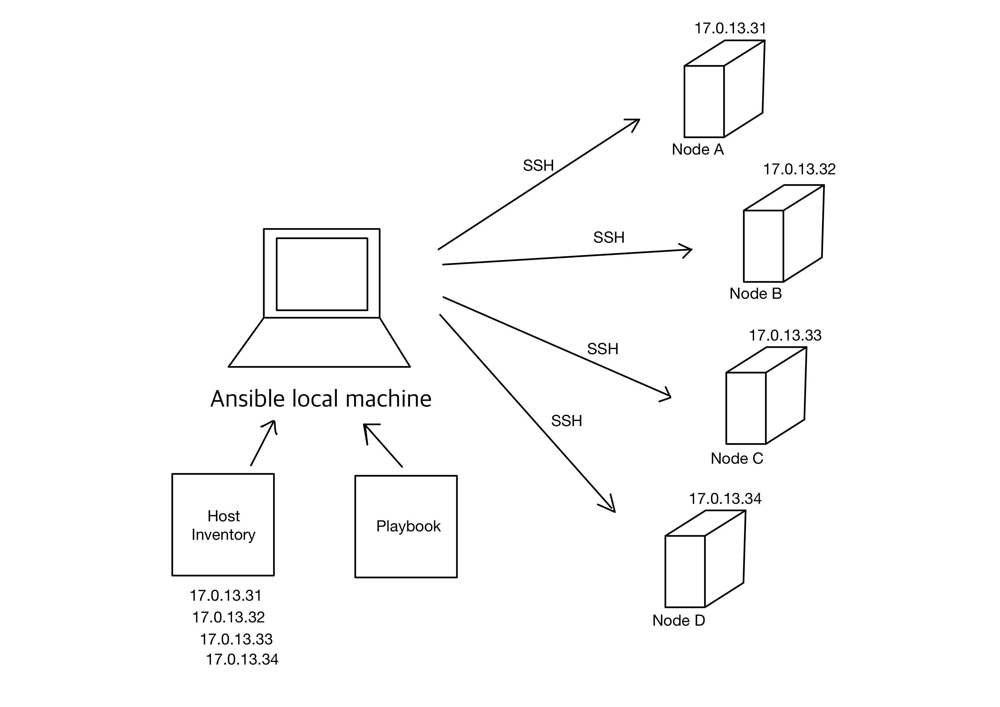

# 4. Survey (개관 논문) 완성
## 🌹 실습 환경
[Overleaf](https://www.overleaf.com/)

## 🌹 개요
컴퓨터 공학 전공 학부생(3~4학년) 또는 개발자를 지망하는 분들에게 유용한 Survey(개관논문)을 작성 및 완성하고자 한다.

## 🌹 주제 
Puppet, Chef, Ansible의 특징 분석 및 비교

* 요약      
    
        기업들의 인프라 환경이 복잡해지면서 인프라를 자동적으로 관리하는 기술인 “IaC(Infrastructure as Code)”에 대한 관심이 꾸준히 증가하고 있다. 이전에는 일일이 해야했던 수작업들에 대해 자동화하여, 반복적인 작업을 최소화하고 IT 인프라를 보다 빠르고 안전하며 일관되게 제공할 수 있다. 빠르고 복잡한 프로비저닝에 대한 수요의 증가로, IaC를 구현하고자 하는 여러 소프트웨어 구성 관리 툴들이 개발이 되었다. 본 논문은 인프라 구성관리도구들 중 Puppet, Chef, Ansible의 특징들을 분석하고 비교함으로써 IaC를 이해하고자 한다.
    
    puppet을 이용한  architecture
     
    chef를 이용한  architecture
     
    ansible을 이용한 architecture
     